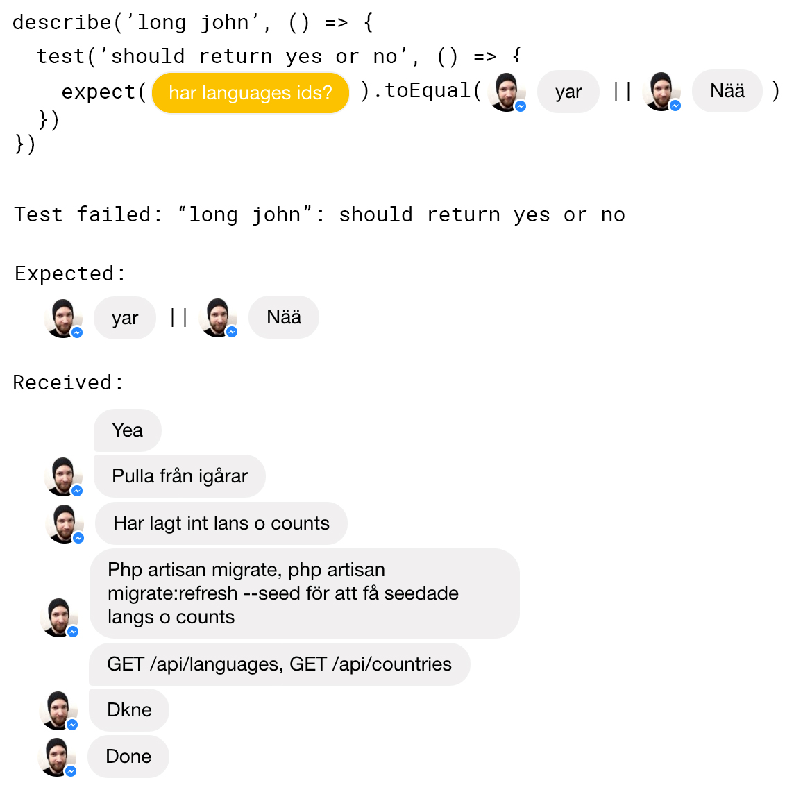

## React snippets

### [Higher-order components](https://facebook.github.io/react/docs/higher-order-components.html)

```js
import React, { Component } from 'react'
import { connect } from 'react-redux'
import { requestDesigner } from './actionCreators'
import { getDesigners } from './selectors'

export const fetchDesigner = (WrappedComponent, args = {}) => {
	return connect(state => ({
		designers: getDesigners(state)
	}), {requestDesigner})(class extends Component {
		constructor(props) {
			super(props)
			const { id, slug } = args
			
			if (slug) {
				this.props.requestDesigner({ slug })
			}
		}

		render() {
			const { designers } = this.props
			const designer = designers[args.slug]
			
			return (
				//<WrappedComponent designer={designer} {...this.props} />
			)
		}
	})
}
```

### [styled-components](https://github.com/styled-components/styled-components)
>  Visual primitives for the component age

```js
import styled from 'styled-components'

const Alert = styled.div`
	padding: .75em 1em;
	margin-bottom: 1em;
	border: 1px solid rgba(0, 0, 0, 0);
	border-radius: 0.3em;

	${ props => props.error && `
		background: rgba(214, 66, 66, 0.1); 
		border-color: rgba(214, 66, 66, 0.05);
		color: rgb(214, 66, 66);
	` }
		
	${ props => props.success && `
		background: rgba(52, 194, 64, 0.1);
		border-color: rgba(52, 194, 64, 0.05);
		color: rgb(52, 194, 64);
	` }
`

export default Alert
```

### [Webpack](https://webpack.js.org/)
>A bundler for javascript and friends. Packs many modules into a few bundled assets. Code Splitting allows to load parts for the application on demand. Through "loaders," modules can be CommonJs, AMD, ES6 modules, CSS, Images, JSON, Coffeescript, LESS, ... and your custom stuff.

```js
const { resolve } = require( 'path' )
const webpack = require( 'webpack' )
const Notifier = require(resolve(process.cwd(), 'resources/utils/notifier'))
const CaseSensitivePathsPlugin = require('case-sensitive-paths-webpack-plugin')

module.exports = {
	context: resolve(process.cwd(), 'resources/client' ),

	entry: {
		main: [
			'react-hot-loader/patch',
			'webpack-dev-server/client?http://localhost:8080',
			'webpack/hot/only-dev-server',
			'./index.js',
		]
	},

	output: {
		path: resolve( process.cwd(), 'public/bundles' ),
		filename: '[name].js',
		chunkFilename: '[name].chunk.js',
		publicPath: 'http://localhost:8080/',
	},

	node: {
		__dirname: true,
	},

	resolve: {
		modules: ['client', 'node_modules'],
		alias: {
			'react': resolve( process.cwd(), 'node_modules/react' ),
			'react-dom': resolve( process.cwd(), 'node_modules/react-dom' )
		}
	},

	devtool: 'eval',

	devServer: {
		hot: true,
		contentBase: resolve(process.cwd(), 'public/bundles'),
		publicPath: 'http://localhost:8080/',
	},

	module: {
		rules: [
			{
				test: /\.js$/, 
				exclude: /node_modules/,
				loader: 'babel-loader',
			},
			{
				test: /\.css$/,
				use: [
					{ loader: 'style-loader' },
					{ loader: 'css-loader' }
				]
			},
			{
				test: /\.(eot|svg|ttf|woff|woff2)$/,
				loader: 'file-loader',
			},
			{
				test: /\.(jpg|png|gif)$/,
				loaders: [
					'file-loader',
					{
						loader: 'image-webpack-loader',
						query: {
							progressive: true,
							pngquant: {
								quality: '65-90',
								speed: 4,
							},
							gifsicle: {
								interlaced: false,
							},
							optipng: {
								optimizationLevel: 7,
							}
						}
					}
				]	
			}
		],
	},

	plugins: [
		new webpack.HotModuleReplacementPlugin(),
		new webpack.NamedModulesPlugin(),
		new webpack.optimize.OccurrenceOrderPlugin( true ),
		new webpack.optimize.CommonsChunkPlugin({
			name: ['vendor', 'manifest'],
			children: true,
			minChunks: 2,
			async: true,
		}),
		new CaseSensitivePathsPlugin(),
		new Notifier(),
	],

	performance: {
		maxEntrypointSize: 2500000,
		maxAssetSize: 2500000,
		hints: false,
	},

	target: 'web',

	node: {
		fs: 'empty',
		net: 'empty',
		tls: 'empty',
	}
}
```

## Redux

### [normalizr](https://github.com/paularmstrong/normalizr)
> Normalizes nested JSON according to a schema

```js
// schemas.js

...

/**
 * Productlist schema
 */

export const productListSchema = new schema.Array(product)

/**
 * Designer schema
 */

export const designerSchema = new schema.Entity('designers', {
	products: productListSchema,
}, {
	idAttribute: 'shop_slug',
})
```

```js
// reducers.js

...

const designerReducer = (state = {}, action) => {
	switch (action.type) {
		case types.REQUEST_DESIGNER_SUCCESS:
			const normalized = normalize(action.payload.designer, designerSchema)
			return merge(Object.assign({}, state), normalized.entities.designers)
		default:
			return state
	}
}

...

```

### [redux-form](https://github.com/erikras/redux-form)
> A Higher Order Component using react-redux to keep form state in a Redux store

```js
import React, { Component, PropTypes } from 'react'
import { arrayMove } from 'react-sortable-hoc'
import FileUploader from 'containers/FileUpload'

class FileField extends Component {

	constructor(props) {
		super(props)

		this.state = {
			files: [],
		}

		this.handleSortEnd = this.handleSortEnd.bind(this)
		this.handleCrop = this.handleCrop.bind(this)
		this.handleDrop = this.handleDrop.bind(this)
	}

	normalizeFiles(files) {
		console.log('normalizeFiles(files)')
		console.log(files)

		return files.map(file => ({
			id: file.name,
			file: file,
			preview: file.preview,
			crop: {},
		}))
	}

	handleSortEnd({ oldIndex, newIndex }) {
		const { input } = this.props
		const files = input.value || []
		const sortedFiles = arrayMove(files, oldIndex, newIndex)
		input.onChange(sortedFiles)
	}

	handleCrop(fileKey, data, crop) {
		// The input prop is injected by a HoC
		const { input } = this.props
		const files = input.value
		
		const filesCopy = files.map((file) => {
			const key = Object.getOwnPropertyNames(file)[0]
			if( key === fileKey ){
				return { 
					[key]: Object.assign({}, file[key], {
						preview: data,
						crop: crop,
					})
				}
			} else {
				return file
			}
		})
		
		input.onChange(filesCopy)
	}

	handleDrop(files) {
		const { input } = this.props
		const normalizedFiles = this.normalizeFiles(files)
		input.onChange(normalizedFiles)
	}

	render() {
		const { input, name } = this.props
		const files = input.value || []

		return(
			<div style={{marginBottom:'8px'}}>
				<FileUploader
					name={ name }
					onDrop={ this.handleDrop }
					files={ files }
					onSortEnd={ this.handleSortEnd }
					onCrop={ this.handleCrop }
				/>
			</div>
		)
	}
}

FileField.propTypes = {
	input: PropTypes.object.isRequired,
	name: PropTypes.string,
}

export default FileField
```


### [redux-saga](https://github.com/redux-saga/redux-saga)
> An alternative side effect model for Redux apps

```js
// sagas.js
import { put, takeLatest, call } from 'redux-saga/effects'
import api from 'data/api'
import * as types from './actionTypes'
import * as actions from './actionCreators'

function* requestDesigners() {
	try {
		const result = yield call(api.fetchDesignerList)
		yield put(actions.requestDesignersSuccess(result.data))
	} catch(e) {
		yield put(actions.requestDesignersFailure(e))
	}
}

function* requestDesigner(action) {
	try{
		const result = yield call(api.fetchDesigner, action.payload)
		yield put(actions.requestDesignerSuccess(result.data))
	} catch(e) {
		yield put(actions.requestDesignerFailure(e))
	}
}

function* designerSaga() {
	yield takeLatest(types.REQUEST_DESIGNER, requestDesigner)
	yield takeLatest(types.REQUEST_DESIGNERS, requestDesigners)
}

export default designerSaga
```

## TDD



## Övrigt

- [react-virtualized](https://github.com/bvaughn/react-virtualized) | components for efficiently rendering large lists and tabular data
- [react-intl](https://github.com/yahoo/react-intl) | Internationalize React apps
- [react-dropzone](https://github.com/okonet/react-dropzone) | Simple HTML5 drag-drop zone with React.js
- [react-router](https://github.com/ReactTraining/react-router) | Declarative routing for React
- [react-storybook](https://github.com/storybooks/react-storybook) | UI Component Dev Environment for React
- [material-ui](https://github.com/callemall/material-ui) | Components that Implement Google's Material Design
